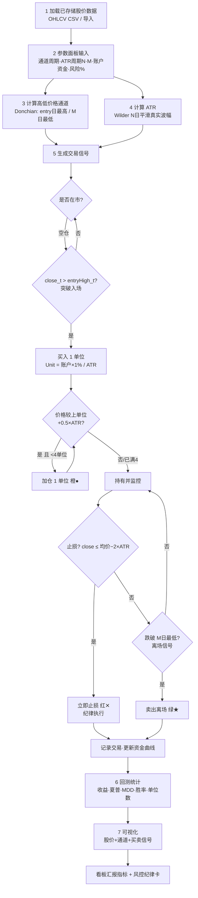
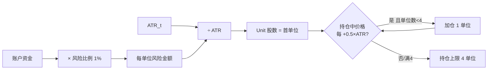
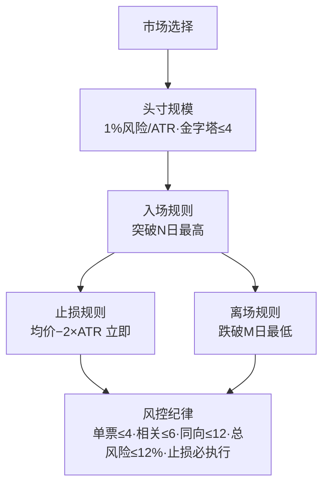

# Task4 海龟交易法则（Turtle Trading）交互看板 — 设计规格 v2.0

> 版本：v2.0 ｜ 模块：`AI-quant-lab/turtle-trading/`
> 定位：在 v1 基础上，按"完整系统"重构——明确**五大核心要素**、给出**ATR 公式与含义**、**仓位管理公式**、**M 日离场**、**风控纪律**，并嵌入**海龟交易法则流程图**。看板仍为自包含离线 HTML（内联 Plotly + 内联 JS 引擎）。
> 配套：本文件取代 `Task4_海龟交易法则_看板_spec.md`（v1）。

---

## 0. 看板要做的 6 件事（用户需求映射）

| # | 需求 | 本规格对应章节 |
|---|------|----------------|
| 1 | 加载已存储的股价数据 | §3 数据层 |
| 2 | 设定高低价格通道周期（默认 20），计算通道，参数可调 | §4.1、§8 参数面板 |
| 3 | 计算 ATR（过去 N 日），N 可调 | §4.2、§8 |
| 4 | 计算买入/卖出交易信号 | §4.3–§4.6、§5 |
| 5 | 绘制可视化：股价 + 通道 + 买卖信号（不同颜色） | §7 |
| 6 | 模拟交易与回测，汇报量化指标 | §5、§6、§7 指标卡 |

---

## 1. 海龟交易法则五大核心要素（系统骨架）

看板必须**显式呈现**这五大要素，每一条都在 UI 有对应参数或说明卡。

### 1.1 市场选择（Market Selection）
- **原则**：只交易流动性充足、波动足够、可自由买卖的市场。
- **看板落地**：标的下拉框提供 5 只已验证前复权标的（A 股 4 + 港股 1）；引擎只接受标准 OHLC 字段；非流动性过滤在教学版可省略，但需在说明卡标注"实盘应剔除低流动性/停牌标的"。
- **ATR 与市场选择的关系**：ATR 衡量波动，波动太小则不值得交易（单位太小、摩擦成本占比高）。看板在 ATR 副图旁标注当前 ATR 数值，供主观判断。

### 1.2 头寸规模（Position Sizing）
- **原则**：用波动性（ATR）把每笔风险固定为账户的 1%，从而"波动大少买、波动小多买"，实现风险归一化。
- **公式（看板核心）**：
  ```
  每单位风险金额 = 账户资金 × 1%
  一个单位(可买股数) = 每单位风险金额 ÷ ATR
  ```
  即：**单位股数 Unit = (账户资金 × 0.01) / ATR**。
- **加仓（金字塔）**：入场后，价格每较**上一单位买入价**上涨 `0.5 × ATR`，再加买 1 个单位，直至**最多 4 个单位**。
- **看板落地**：§4.3 详述；参数面板暴露"风险比例%（默认 1）""账户资金（默认 1,000,000）""加仓步长×N（默认 0.5）""最大单位数（默认 4）"。

### 1.3 入场规则（Entry）
- **原则**：唐奇安通道突破——价格创 **N 日新高**即入场。
- **默认通道周期 = 20 日**（可在参数面板调节）。
- **看板落地**：§4.3；买入信号用红色 ★ 标记。

### 1.4 止损规则（Stop Loss）
- **原则**：保护本金，单笔亏损封顶。
- **默认 2×ATR 止损**：`持仓均价 − 2×ATR` 被跌破即**全部平仓止损**，立即执行。
- **看板落地**：§4.5；止损线用虚线绘制，触发点用红色 ✕ 标记；参数面板暴露"止损倍数×N（默认 2）"。

### 1.5 离场规则（Exit / 系统离场）
- **原则**：趋势反转确认后离场，让利润奔跑但不坐过山车。
- **默认 M 日最低价离场**：价格跌破**过去 M 日最低价**即卖出。
- **M 默认 = 10 日**（可在参数面板调节）。
- **看板落地**：§4.6；卖出信号用绿色 ★ 标记。

> 注：止损（§1.4）与离场（§1.5）是两条**独立**的退出线——止损是"亏太多立刻走"，离场是"趋势破了走"。两者同时满足时以先触发者为准。

---

## 2. ATR 计算公式与含义（看板必现内容）

### 2.1 真实波幅 TR（True Range）
```
TR_t = max( H_t − L_t , |H_t − C_{t-1}| , |L_t − C_{t-1}| )
```
- `H_t` 当日最高，`L_t` 当日最低，`C_{t-1}` 前收。
- 三项分别刻画：当日本身振幅、向上跳空、向下跳空。

### 2.2 ATR（Average True Range，Wilder 1978 平滑）
```
ATR_t = ( ATR_{t-1} × (N−1) + TR_t ) / N      # N 日 Wilder 指数平滑
ATR_首值 = mean( 前 N 日 TR )                   # 预热期取均值
```

### 2.3 含义解释（看板文字卡）
- **ATR 是"平均真实波动幅度"**，代表一只股票近期每天大致波动多少钱。
- **ATR 越大 → 波动越剧烈 → 单位股数越少**（同样的 1% 风险对应更少股数），反之亦然。这正是海龟"用波动定仓位"的精髓。
- **正常波动**：价格在一个 ATR 范围内上下，属健康震荡。
- **跳空高开（Gap Up）**：当日最低价 > 前收 `C_{t-1}`，即 `|L_t − C_{t-1}|` 那一项主导，TR 被拉大，常出现在利好。
- **跳空低开（Gap Down）**：当日最高价 < 前收，即 `|H_t − C_{t-1}|` 主导，TR 拉大，常出现在利空。
- 看板在 ATR 副图旁固定展示上述文字 + 当前标的当前 ATR 数值。

> **N = ATR(N)**：海龟原书用 N 表示 ATR，本看板沿用此叫法，参数"ATR 周期 N"即此处 N（默认 20，可调）。

---

## 3. 数据层设计

### 3.1 加载已存储数据
- 数据点 1（构建内联）：生成器把 5 只标的 CSV **内联嵌入** HTML，离线可直接用。
- 数据点 2（免重建导入）：看板提供「导入最新 CSV」按钮，读取本地 `*_qfq.csv`，无需重建 HTML。
- 顶部常驻**「数据最后交易日：YYYYMMDD」**徽标。

### 3.2 数据来源与口径
- 全部**真前复权**（akshare 新浪源，2026-07-11 已修复）。
- 标准字段：`ts_code, trade_date, open, high, low, close, ...`，引擎只用 `trade_date, open, high, low, close`。
- 日期 `YYYYMMDD` 升序。

### 3.3 每日补充
- `update_turtle_data.py` 增量追加最新前复权日线（幂等、UTF-8-SIG）。建议回测前先跑一次。

---

## 4. 海龟交易系统逻辑定义（默认系统 = 经典 S1：20/10）

> 默认通道：入场 20 日 / 离场 10 日 / ATR 周期 20。三者均可调。可选「S2 预设 55/20」一键切换，作为进阶对照（保留 v1 能力）。

### 4.1 高低价格通道（唐奇安通道）
```
上轨 entryHigh_t = max( high_{t−entry} … high_{t−1} )   # 过去 entry 日最高（不含 t）
下轨 exitLow_t   = min( low_{t−exit}  … low_{t−1}  )   # 过去 exit 日最低（不含 t）
```
- `entry` 默认 20（可调）；`exit` 对应 M，默认 10（可调）。

### 4.2 ATR（N 日）
见 §2。参数"ATR 周期 N"默认 20，可调。

### 4.3 入场与加仓信号
1. **首单位**：当 `close_t > entryHigh_t` → 买入信号（红 ★），市价买入 `Unit` 股。
   ```
   Unit = (账户资金 × 风险比例%) / (100 × ATR_t)     # 风险比例默认 1 → 即 1%
   ```
2. **加仓（金字塔）**：价格每较**上一单位买入价**上涨 `addOnStep × ATR`（默认 0.5×ATR），再加买 1 个 `Unit`（橙 ● 标记），直到持有达 `maxUnits`（默认 4）。
3. 记录每个单位的买入价 → 用于持仓均价与止损。

### 4.4 持仓均价
```
持仓均价 = Σ(各单位买入价 × 股数) / Σ股数
```

### 4.5 止损（2×ATR，立即执行）
```
若 close_t ≤ 持仓均价 − stopMult × ATR_t   （stopMult 默认 2）
  → 全部平仓，红 ✕ 标记，纪律执行不分条件
```

### 4.6 离场（跌破 M 日最低价）
```
若 close_t < exitLow_t   （M = exit 周期，默认 10）
  → 全部平仓，绿 ★ 标记（系统离场 / 止盈离场）
```

### 4.7 做空（默认关，long-only）
- A 股现货难做空，默认 long-only。
- 开关开启时对称：入场=跌破 past entry 日最低；离场=反弹破 past exit 日最高；止损=均价 + 2×ATR。

### 4.8 成本与权益
- 每日盯市：`权益_t = 现金_t + 持仓股数 × close_t`。
- 交易成本：买卖各按费率（默认万三 0.03%）扣减，可关闭。
- 买入持有基准：净值 = `close_t / close_0`，与策略资金曲线同图对比。

---

## 5. 回测引擎实现（前端 JS 移植）

纯 JavaScript，运行于浏览器，作用于内联/导入数据。模块：
1. `calcATR(data, N)` → ATR 序列
2. `donchian(data, period, side)` → 上/下轨序列
3. `runSystem(data, params, equity0)` → 单系统回测，返回交易列表 + 权益序列 + 单位序列
4. `metrics(equitySeries, trades, rf)` → 全部指标
5. `render(...)` → 驱动可视化

**预热期**：前 `max(entry, exit, N)` 日无信号；时段短于预热期 → 弹告警。无交易 → 指标显示"无交易"，不出现 NaN。

---

## 6. 回测量化指标（看板指标卡汇报）

| 指标 | 公式 / 口径 | 教学阈值 |
|------|-------------|----------|
| 累计收益率 | 期末权益/初始 − 1 | — |
| 年化收益率 | (期末/初始)^(252/交易日数) − 1 | <0 亏 / 0–5% 一般 / 5–10% 良 / >10% 优 |
| 夏普比率 | (日均收益 − rf/252)/日均收益std × √252 | <0 无效 / 0–1 一般 / 1–2 有效 / >2 优 |
| 最大回撤 MDD | max(峰值−当前)/峰值 | <10% 低 / 10–20% 中 / 20–30% 较高 / >30% 高 |
| 胜率 | 盈利交易/总交易 | % |
| 盈亏比 | 平均盈利/平均亏损 | — |
| 期望收益 | 胜率×平均盈利 + (1−胜率)×平均亏损 | — |
| 交易次数 / 平均持仓天数 | 自然日差均值 | — |
| 相对买入持有超额 | 策略累计 − 同期买入持有 | 标注"超额为负≠亏损" |
| **平均/最大持有单位** | 回测中单位数的均值与峰值 | 验证 ≤4 纪律 |
| **单笔最大亏损%** | max(−单次收益/对应权益) | 验证 ≈2%×单位数 |

- `rf` 默认 **1.79%**（10Y 国债均值），可调。
- 看板**显式汇报** Unit 股数、1% 风险金额、ATR 当前值，使仓位公式可追溯。

---

## 7. 可视化设计（Plotly，涨红跌绿）

| 图 | 内容 |
|----|------|
| 主图 | K 线 + 唐奇安上轨(entry 高点连线) + 下轨(exit 低点连线) + N 带(均价±2N 阴影) + **买入★红** / **卖出★绿** / **加仓●橙** / **止损✕红虚线** |
| 图2 | 策略资金曲线 vs 买入持有净值（起点 1.0） |
| 图3 | 回撤曲线（负向填充） |
| 图4 | ATR(N) 副图 + ATR 含义文字卡 |
| 表 | 交易记录（序号/买日/卖日/买价/卖价/股数/单位数/净利/单次收益%/持仓天数） |

- 配色约定：**涨=红、跌=绿**（A 股习惯）；买入红、卖出绿、加仓橙、止损红✕。
- 交互：框选缩放、悬停看 OHLC 与信号；参数改动后点「运行回测」实时刷新。
- 「五大核心要素」与「风控纪律」以固定说明卡/侧栏常驻，不随参数变化消失。

---

## 8. 参数调节面板（左侧，全部可调）

| 控件 | 默认值 | 说明 |
|------|--------|------|
| 标的选择 | 5 只下拉 | 市场选择 |
| 时段 | 起止/快捷 | 近1年/近3年/全部 |
| 系统预设 | S1(20/10) | 可选 S2(55/20) |
| **通道周期 entry** | **20** | 高低价格通道（入场突破） |
| **离场周期 M (exit)** | **10** | 跌破 M 日最低价离场 |
| **ATR 周期 N** | **20** | ATR 计算窗口 |
| 风险比例 % | 1 | 每单位风险占账户比 |
| 账户资金 | 1,000,000 | 头寸规模分母 |
| 加仓步长 ×N | 0.5 | 每涨 0.5×ATR 加 1 单位 |
| 最大单位数 | 4 | 单标的最多 4 单位 |
| 止损倍数 ×N | 2 | 均价 − 2×ATR 止损 |
| 做空开关 | 关 | long-only 默认 |
| 交易成本开关 + 费率 | 开/万三 | — |
| rf 无风险利率 % | 1.79 | 夏普分母 |
| 按钮 | 运行回测 | — |
| 顶部徽标 | 数据最后交易日 + 导入 CSV | — |

---

## 9. 风险控制原则（纪律卡，看板必现）

> 以下为海龟原教旨风控纪律，看板以醒目卡片常驻展示，并在回测中**强制/提示**执行。

1. **单个股票最多买入 4 个单位**（= maxUnits，引擎硬性封顶）。
2. **高度相关市场合计不超过 6 个单位**（如中芯 A 与中芯 H 视为高度相关）。
3. **同一方向所有头寸合计不超过 12 个单位**（多/空分别计）。
4. **账户总风险不超过 12%**（总风险 = Σ单位数 × 1% × 2(止损倍数) ≈ 单位数×2%；12 单位≈24%… 故实际以" units 约束"为准，看板展示该换算并提示）。
5. **触发止损信号必须立即执行**，不得犹豫、不得摊平。
6. **必须严格执行纪律**——系统是机械的，主观干预是亏损根源。

> 单标的回测下，引擎自动保证规则 1；规则 2–4 为组合层约束，看板在"多标的监控"提示区展示，并标注"同时运行多标的时需人工核对"。

---

## 10. 海龟交易法则流程图（Mermaid）

### 10.1 主流程（信号 → 交易 → 回测）


### 10.2 头寸规模与加仓（金字塔）


### 10.3 五大核心要素总览


---

## 11. 交付物清单

| 文件 | 说明 |
|------|------|
| `task4_turtle_trading_spec_v2.md` | 本规格（取代 v1） |
| `gen_task4_turtle_dashboard.py` | 看板生成器（读 CSV → 内联数据+引擎+Plotly） |
| `task4_turtle_dashboard.html` | 自包含交互看板（0 外链、可离线） |
| `update_turtle_data.py` | 每日增量更新脚本 |
| `.github/workflows/daily_update.yml` + `pages.yml` | 每日自动化 + Pages 部署 |

---

## 12. 验证标准

- **外链检查**：grep 外部 `<script src>` = 0；仅内联 Plotly。
- **JS 语法**：`node --check` 通过。
- **算法对账**：公开示例数据手算核对 Unit 股数、2×ATR 止损点、0.5×ATR 加仓点、M 日离场点。
- **资金对账**：Σ净利润 = 期末权益 − 初始权益（计成本时成立）。
- **约束对账**：回测中单位数峰值 = 4（封顶）；单笔最大亏损 ≈ 2%×单位数。
- **边界**：时段 < 预热期 → 弹告警；无交易 → "无交易"而非 NaN。
- **流程图渲染**：GitHub / 看板内 Mermaid 三种图均正常显示。

---

## 13. 与 v1 的差异（升级点）

1. 新增**五大核心要素**显式章节与 UI 说明卡。
2. 新增 **ATR 公式 + 含义**（正常波动/跳空高开/跳空低开）文字卡。
3. 头寸规模公式明确为 **Unit = 账户×1% / ATR**，加仓 0.5×ATR、上限 4 单位。
4. 离场明确为 **M 日最低价**（默认 10，可调），与 2×ATR 止损并列。
5. 新增**风控纪律卡**（单票≤4 / 相关≤6 / 同向≤12 / 总风险≤12% / 止损必执行）。
6. 新增**海龟交易法则流程图**（主流程 + 头寸规模 + 五要素三张 Mermaid）。
7. 指标汇报新增**平均/最大持有单位、单笔最大亏损%**，使纪律可量化验证。
